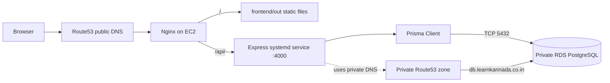
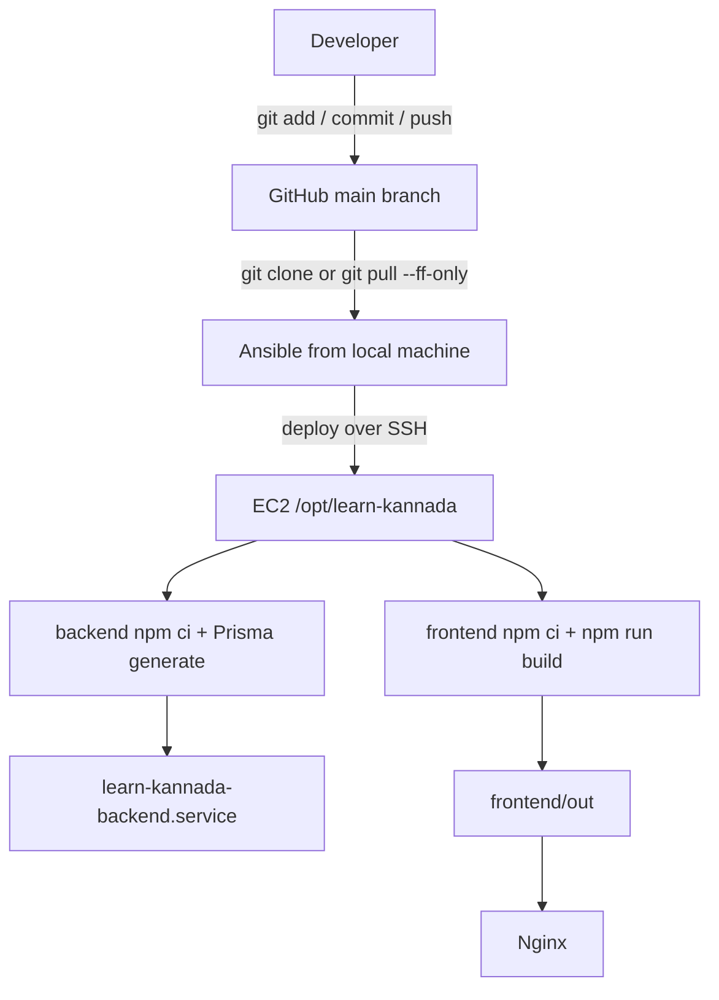
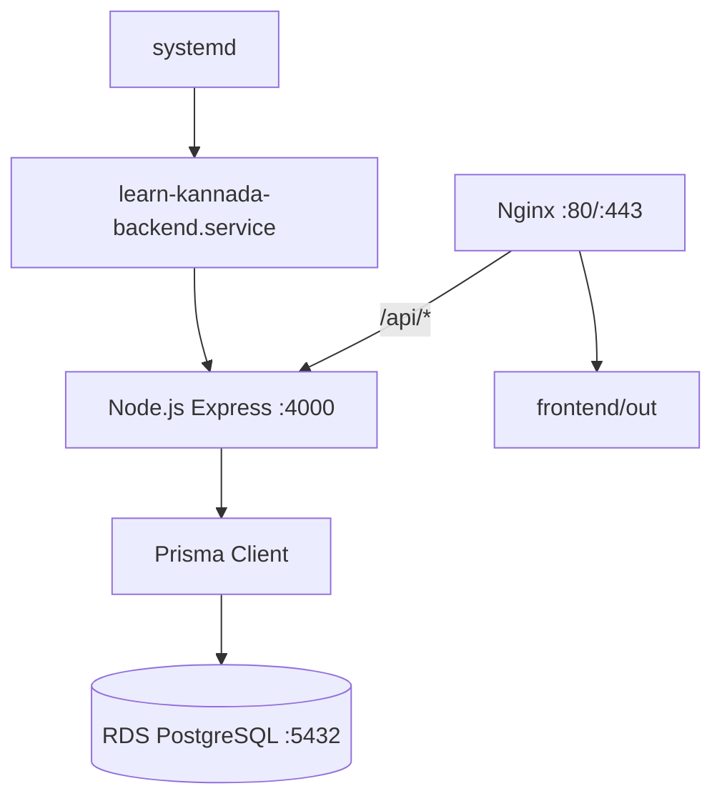

# Learn Kannada

Learn Kannada is deployed as a small AWS application with a static Next.js frontend, an Express API, and a private PostgreSQL database.

## Architecture

```text
Browser
	|
	v
Nginx on EC2
	|-- /       -> /opt/learn-kannada/frontend/out (static Next.js files)
	|-- /api/  -> Express on 127.0.0.1:4000
										|
										v
								 Private RDS PostgreSQL
```

- Terraform creates the EC2 instance, Elastic IP, security groups, RDS PostgreSQL instance, and DNS records.
- Ansible clones this repository onto the EC2 instance and deploys the application.
- Nginx serves the static frontend directly. There is no frontend daemon.
- Express runs as the `learn-kannada-backend` systemd service.
- Prisma is used by Express for the PostgreSQL connectivity check.

### Request Flow



The browser can reach the public EC2 address, but it cannot reach the private RDS instance directly. Only the EC2 security group is allowed to connect to PostgreSQL on port `5432`.

## Repository Layout

```text
backend/                 Express API and Prisma client
frontend/                Static-exported Next.js application
infra/                   Terraform AWS infrastructure
infra/ansible/           Server deployment playbook and templates
```

## Git Repository

The source repository is:

```text
https://github.com/baramsivaramireddy/learn_kannada.git
```

The `main` branch is the deployment source. Ansible clones or updates it on the EC2 host at:

```text
/opt/learn-kannada
```

### Git Deployment Flow



Ansible also repairs an incomplete checkout. If `/opt/learn-kannada/.git` is missing, it recreates the directory and clones the repository. If the checkout exists but has a broken `origin`, it restores the remote. Existing checkouts are updated with `git pull --ff-only origin main`; local changes or diverged history cause deployment to stop instead of being discarded or merged.

Do not commit these files:

- `backend/.env`, because it contains database credentials.
- `infra/terraform.tfvars`, because it contains Terraform input secrets.
- Terraform state files, because they can contain sensitive infrastructure data.
- `node_modules`, `.next`, `frontend/out`, and Python virtual environments.

## Backend API

The backend listens on port `4000`.

```text
GET  /health
GET  /db-health
GET  /catalog/sections
GET  /catalog/sections/:sectionId
GET  /catalog/subsections/:subsectionId
GET  /catalog/quizzes/:quizId
POST /quizzes/:quizId/submit
```

Through Nginx, the same routes are available at:

```text
GET  https://dev.learnkannada.co.in/api/catalog/sections
POST https://dev.learnkannada.co.in/api/quizzes/:quizId/submit
```

Catalog routes return PUBLIC content only. Quiz submissions accept
`{ "answers": [{ "quizItemId": "...", "selectedOptionIds": ["..."] }] }`.
SCQ and SOUND answers must select one option; MCQ answers must match the full
correct set. Omitted answers count as incorrect. The API returns the percentage,
pass/fail result, and per-question review without storing learner progress.

Content authoring routes require `Authorization: Bearer $CONTENT_ADMIN_TOKEN`:

```text
POST  /admin/assets/upload-url
POST  /admin/sections                 PATCH /admin/sections/:id
POST  /admin/subsections              PATCH /admin/subsections/:id
POST  /admin/learning-items           PATCH /admin/learning-items/:id
POST  /admin/quizzes                  PATCH /admin/quizzes/:id
POST  /admin/quiz-items               PATCH /admin/quiz-items/:id
PATCH /admin/:resource/:id/visibility
```

The upload-url endpoint registers a DRAFT asset and returns a 15-minute S3
pre-signed PUT URL. Upload the file to that URL using its returned headers, then
publish the asset through the visibility endpoint. Configure `S3_BUCKET`,
`AWS_REGION`, and `ASSET_BASE_URL`; the latter must be the CloudFront HTTPS
hostname so only CDN URLs are stored in `Asset.url`. After applying Terraform,
get it with `cd infra && terraform output -raw asset_base_url`, then set that
value in `backend/.env`. Upload registration stays disabled until this CDN URL is
configured. AWS credentials use the default AWS credential chain (prefer the
EC2 instance role in deployment). The S3 bucket remains private behind
CloudFront; browser uploads use bucket CORS allowing PUT from the authoring
origin.

The Prisma v1 schema and initial migration live under `backend/prisma`. Apply the
migration before starting the API. The Ansible deployment playbook runs
`prisma migrate deploy` after generating the Prisma client; ensure `backend/.env`
contains a valid `DATABASE_URL` for the existing `learnkannada` database.

```bash
cd backend
npx prisma migrate deploy
npm run prisma:generate
npm test
```

## Local Development

### Backend

Create `backend/.env` from `.env.example` and set the database settings and a
private `CONTENT_ADMIN_TOKEN`. This file is ignored by Git.

```env
PORT=4000
DB_HOST=db.learnkannada.co.in
DB_PORT=5432
DB_NAME=learnkannada
db_username=your_database_username
db_password=your_database_password
```

Install and run the API:

```bash
cd backend
npm ci
npx prisma migrate deploy
npm run prisma:generate
npm run dev
```

Test it:

```bash
curl http://localhost:4000/health
curl http://localhost:4000/db-health
```

The private RDS database is not reachable from a normal local machine. The database check should be run on the EC2 host, where the security group permits PostgreSQL traffic.

### Frontend

```bash
cd frontend
npm ci
npm run dev
```

The frontend uses `/api` in production through Nginx. For local development, run
the backend on port `4000` and set `NEXT_PUBLIC_API_URL=http://localhost:4000`
before starting Next.js.

Build the static site:

```bash
npm run build
```

The generated files are written to `frontend/out`.

## Infrastructure

Terraform uses the AWS region `ap-south-2` and requires database variables:

```hcl
db_username = "your_database_username"
db_password = "your_database_password"
```

Use a local ignored `infra/terraform.tfvars` file and never commit it.

```bash
cd infra
terraform init
terraform plan
terraform apply
```

Terraform outputs the application IP and database hostname:

```bash
terraform output app_public_ip
terraform output database_hostname
```

### AWS Resources

Terraform in `infra/main.tf` manages these resources:

| Resource | Purpose |
| --- | --- |
| `aws_instance.app_server` | Ubuntu EC2 host for Nginx and Express |
| `aws_eip.app` | Stable public IP for the EC2 host |
| `aws_security_group.app` | Allows HTTP, HTTPS, and SSH to EC2 |
| `aws_db_instance.postgres` | Private PostgreSQL RDS database |
| `aws_security_group.database` | Allows PostgreSQL only from the app security group |
| `aws_db_subnet_group.postgres` | Places RDS in the default VPC subnets |
| `aws_route53_record.root` | Public DNS for `dev.learnkannada.co.in` |
| `aws_route53_record.database` | Private DNS for `db.learnkannada.co.in` |

The application and database are in the default VPC. The RDS instance has `publicly_accessible = false`, so its endpoint is reachable only from resources with network access inside the VPC.

### Terraform Tooling

- **Terraform**: declares and provisions AWS infrastructure.
- **AWS provider**: connects Terraform to AWS in `ap-south-2`.
- **Terraform state**: records the real AWS resource IDs and is ignored by Git.
- **Terraform variables**: provide the database username and password through `terraform.tfvars` or another protected input method.

Never put real passwords directly in committed `.tf` files.

The RDS instance is private. The database DNS record is therefore created in the VPC-associated private Route53 zone, not only in the public zone. After changing the DNS configuration, apply Terraform before testing from EC2:

```bash
cd infra
terraform plan
terraform apply
```

Verify database DNS and connectivity from the EC2 instance:

```bash
getent hosts db.learnkannada.co.in
nc -vz -w 5 db.learnkannada.co.in 5432
curl http://127.0.0.1:4000/db-health
```

If `getent hosts` returns nothing, the private Route53 record is not available to the VPC yet. Check that Terraform applied the private-zone record and that the EC2 instance and RDS instance are in the same VPC.

## Server Deployment

The Ansible inventory targets `dev.learnkannada.co.in` using the Ubuntu user and SSH key configured in `infra/ansible/inventory.ini`.

Before running Ansible:

1. Push the application code to the GitHub repository configured in `system.yml`.
2. Confirm `backend/.env` exists locally and contains the database credentials.
3. Confirm DNS points `dev.learnkannada.co.in` to the Terraform Elastic IP.

Run the deployment:

```bash
cd infra/ansible
source .venv/bin/activate
ansible-playbook --syntax-check -i inventory.ini system.yml
ansible-playbook -i inventory.ini system.yml
```

The playbook:

- Installs Node.js, Git, and Nginx.
- Creates and enables a 2 GB swap file for the `t3.micro` build host.
- Clones or updates the GitHub repository at `/opt/learn-kannada`.
- Repairs the repository remote or recreates `/opt/learn-kannada` if it is not a valid Git checkout.
- Copies the ignored local `backend/.env` to the server with mode `0600`.
- Installs dependencies and generates the Prisma client.
- Builds the static Next.js site.
- Runs provisioning tasks with sudo and assigns `/opt/learn-kannada` to the `learnkannada` service user.
- Installs and starts the Express systemd service.
- Configures Nginx to serve the frontend and proxy `/api/` to Express.
- Obtains and verifies the HTTPS certificate with Certbot.

The playbook checks Nginx through `127.0.0.1` with the production `Host` header. This avoids failing when the EC2 instance cannot resolve its own public DNS name, even though the site works from a browser.

The Git, npm, Prisma, and frontend build tasks run with the playbook's normal sudo privileges. This avoids an ACL compatibility issue on some Ubuntu images when Ansible tries to become the unprivileged `learnkannada` user. The application files are reassigned to `learnkannada` before the backend service starts.

If Ansible reports an error like this:

```text
Failed to set permissions on the temporary files Ansible needs to create
chmod: invalid mode: 'A+user:learnkannada:rx:allow'
```

Make sure you are using the project virtual environment and rerun the playbook:

```bash
cd infra/ansible
source .venv/bin/activate
ansible-playbook --syntax-check -i inventory.ini system.yml
ansible-playbook -i inventory.ini system.yml
```

If `npm ci` fails with return code `-9` and no useful npm error, the Linux kernel likely stopped the process because the `t3.micro` ran out of memory. The playbook creates `/swapfile` before installing dependencies and limits the frontend build memory usage.

### Deployment Tools

| Tool | Role |
| --- | --- |
| Git | Retrieves the application source from GitHub |
| Ansible | Automates server configuration and deployment over SSH |
| Node.js 22 | Runs Express and builds Next.js |
| npm | Installs JavaScript dependencies and runs build scripts |
| Prisma | Opens and tests the PostgreSQL connection from Express |
| systemd | Keeps the Express backend running and restarts it after failure |
| Nginx | Serves static files and proxies `/api/` to Express |
| Certbot | Obtains and renews the HTTPS certificate |
| Route53 | Provides public and private DNS records |

### Runtime Process Layout



The static frontend does not run as a service. `npm run build` creates `frontend/out`, and Nginx serves those files. Only the backend needs a long-running daemon because it executes API requests and database queries.

Useful server checks:

```bash
sudo systemctl status learn-kannada-backend
sudo journalctl -u learn-kannada-backend -f
curl http://127.0.0.1:4000/health
curl https://dev.learnkannada.co.in/api/health
curl https://dev.learnkannada.co.in/api/db-health
```

## SSH Host-Key Mismatch

If the EC2 instance was recreated, its SSH host key changes. SSH may then show:

```text
Offending ECDSA key in /home/siva/.ssh/known_hosts:18
Host key for dev.learnkannada.co.in has changed
Host key verification failed
```

Only remove the old key after confirming that DNS now points to the intended EC2 instance:

```bash
ssh-keygen -f "$HOME/.ssh/known_hosts" -R "dev.learnkannada.co.in"
```

Connect again and verify the new fingerprint against the EC2 instance or your trusted server record before accepting it:

```bash
ssh -i "$HOME/.ssh/id_ed25519" ubuntu@dev.learnkannada.co.in
```

The expected ED25519 fingerprint from the current deployment is:

```text
SHA256:BEraa2HHksZcb8Nc/kBdW07Q0wAkoAi38aFuGlSjdC8
```

After SSH succeeds, rerun Ansible:

```bash
cd infra/ansible
source .venv/bin/activate
ansible-playbook -i inventory.ini system.yml
```

## Ignored Files

The repository ignores Terraform state and variables, Node dependencies, Next.js build output, Python virtual environments, logs, and environment files. Commit lockfiles such as `backend/package-lock.json` and `frontend/package-lock.json`, but never commit credentials or Terraform state.
